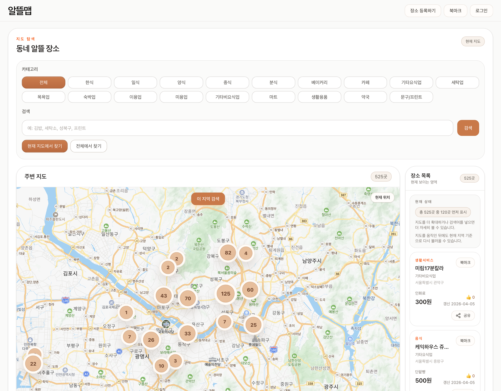
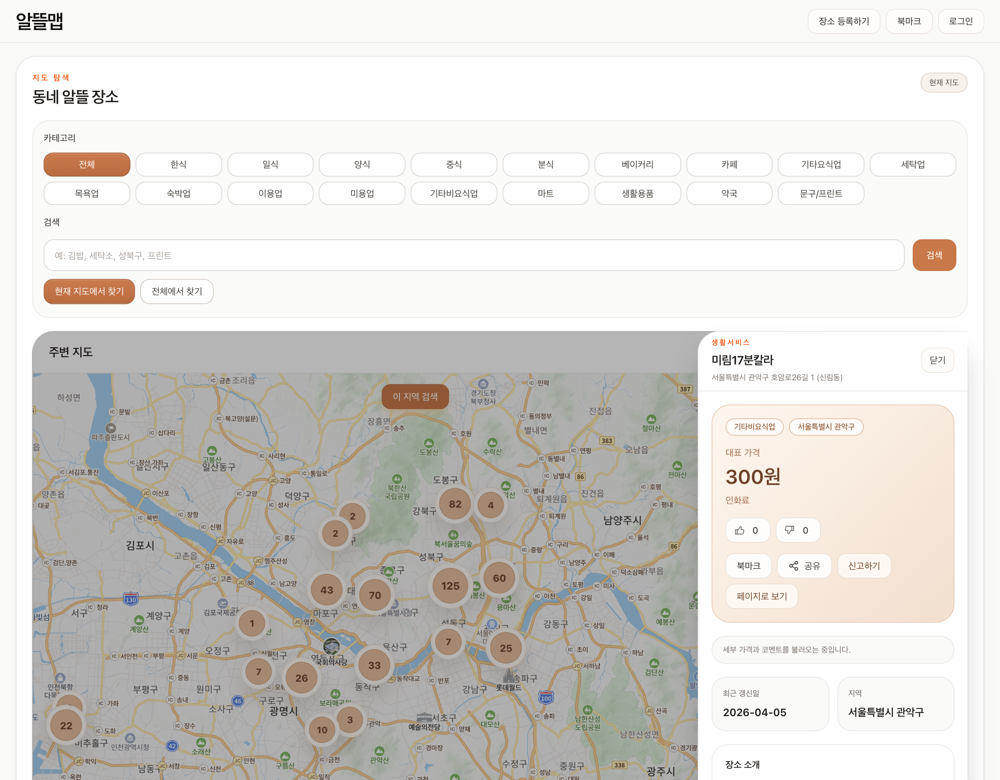
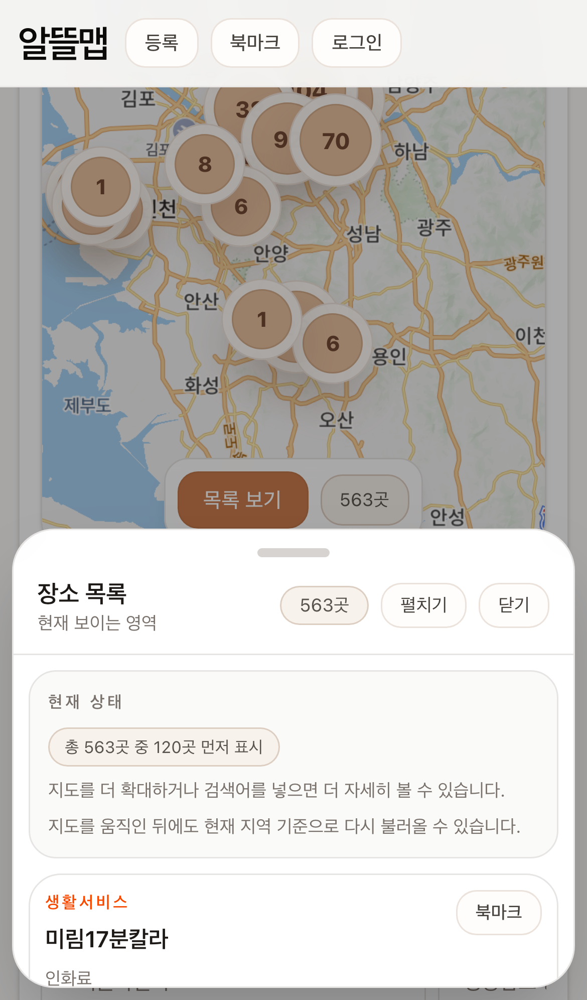
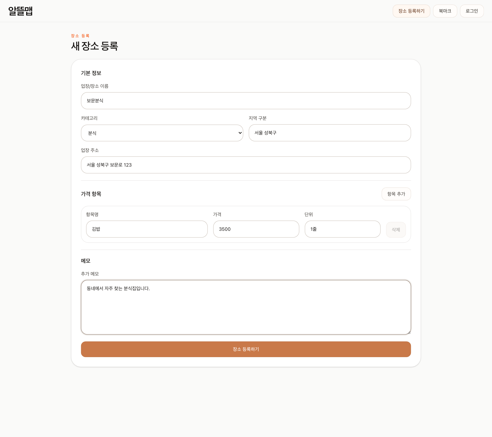
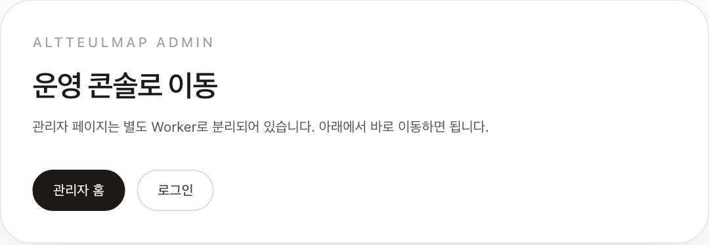

# 알뜰맵 (Altteulmap)

> A map-first service for finding, contributing, and moderating affordable local places in Korea.


- Demo: [altteulmap.altteul-lab.workers.dev](https://altteulmap.altteul-lab.workers.dev)
- Admin: [altteulmap-admin.altteul-lab.workers.dev](https://altteulmap-admin.altteul-lab.workers.dev)
- Docs: [Cloudflare deploy guide](docs/deploy/deploy-cloudflare.md)

최근 유행했던 `거지맵` 서비스에서 아이디어를 얻었습니다. 다만 음식점에만 머무르지 않고, 생활 서비스까지 포함한 더 넓은 절약 지도 형태로 확장하고 싶었습니다. 여기에 공공데이터를 적극적으로 활용해 실제 운영 가능한 데이터 기반 서비스를 만들고 싶었고, 고물가와 취업난이 겹친 지금의 시대감에도 잘 맞는 주제라고 판단해 개발했습니다.



## At a Glance

- 실제 공공 데이터 1,000건을 정제해 지도 탐색 경험에 투입했습니다.
- 장소 등록, 가격 제보, 신고는 공개 참여로 받고 `AI 1차 검수 + 운영자 최종 확정`으로 반영합니다.
- 공개 앱과 관리자 앱을 Cloudflare Workers로 분리해 무료 플랜 제약 안에서 배포했습니다.
- Playwright E2E, smoke, live deploy check까지 포함해 “보여주는 데모”보다 “운영 가능한 MVP”에 가깝게 만들었습니다.

## Highlights

- `Map-first UX`: 첫 화면이 바로 지도이고 목록과 상세 시트가 같은 맥락에서 이어집니다.
- `Real data import`: 행정안전부 `착한가격업소` 데이터를 직접 수집·정규화·적재했습니다.
- `Open contribution loop`: 익명 제보를 허용하되 AI 1차 검수와 운영자 최종 확정으로 데이터 품질을 관리합니다.
- `Public/Admin split`: 번들 크기와 운영 제약에 맞춰 public worker와 admin worker를 분리했습니다.
- `Verified delivery`: lint, build, Playwright E2E, local/remote smoke, live Cloudflare deploy까지 닫았습니다.

## Screenshots

| Home | Detail Sheet |
| --- | --- |
|  |  |

| Mobile | Submission |
| --- | --- |
|  |  |

| Admin |
| --- |
|  |

## How It Works

1. 지도에서 현재 위치와 검색어 기준으로 저렴한 장소를 찾습니다.
2. 상세 시트에서 가격, 반응, 공유, 북마크를 확인합니다.
3. 비회원도 장소 등록, 댓글, 가격 제보, 신고를 남길 수 있습니다.
4. 장소 등록, 가격 제보, 신고는 관리자 앱에서 AI 1차 검수 제안과 함께 확인하고 운영자가 최종 확정합니다.

## Why This Repo Is Worth Opening

- `서비스 관점`: 탐색, 참여, AI 1차 검수, 운영 반영까지 한 사이클이 실제로 닫혀 있습니다.
- `엔지니어링 관점`: Cloudflare Workers 무료 플랜 제약 때문에 public/admin split, 번들 경량화, runtime smoke를 직접 정리했습니다.
- `데이터 관점`: mock이 아니라 실데이터 import와 운영용 moderation 흐름이 같이 있습니다.
- `작업 방식 관점`: AI를 구현 보조로만 쓰지 않고 계획, 검증, 문서화, 운영 검수 초안까지 연결했습니다.

## AI-Native Workflow

- `docs/project/PLAN.md`와 `docs/project/PROGRESS.md`를 유지하며 계획과 실행 로그를 분리했습니다.
- 관리자 큐에서는 로컬 검수 에이전트가 장소 등록/가격 제보/신고에 대해 권장 액션과 근거를 먼저 생성합니다.
- 구현 후에는 `lint`, `build`, `Playwright E2E`, `smoke`를 기준으로 종료했습니다.
- repo-local hooks와 검증 스크립트로 품질 기준을 저장소 안에 고정했습니다.

## Current Rollout Plan

- `AI moderation rollout`: `moderation_suggestions` migration 적용 후 public/admin worker를 다시 배포하고 live 관리자 큐에서 AI 패널 노출을 확인합니다.
- `Operational QA`: iPhone Safari, Android Chrome 기준으로 `현재 위치`, `이 지역 검색`, 목록/상세 시트 제스처, 관리자 AI 검수 패널까지 다시 점검합니다.
- `Launch decision`: `workers.dev`를 그대로 운영할지 custom domain을 붙일지 결정한 뒤 canonical, sitemap, auth URL을 최종 고정합니다.

## Verification

```bash
npm run verify
npm run test:e2e
npm run smoke:local
npm run smoke:remote
```

- GitHub Actions: `Verify`, `E2E Full`, `Deploy Config Check`
- Cloudflare: public/admin split deploy + live `workers.dev` smoke

## Stack

- Next.js 16, React 19, Tailwind CSS 4
- Cloudflare Workers, OpenNext, Wrangler
- PostgreSQL, Drizzle ORM
- NAVER Maps JavaScript API
- Auth.js credentials
- Playwright, ESLint

## Run Locally

```bash
npm run db:up
npm run db:push
npm run db:seed
npm run dev
```

- App: `http://localhost:3000`
- Admin preview: `npm run preview:admin`
- README screenshots: `npm run readme:screenshots`

## Next

- custom domain 최종 적용 여부 확정
- 모바일 제스처와 소규모 상호작용 polish
- 공유 telemetry를 추천/랭킹에 더 연결할지 결정
