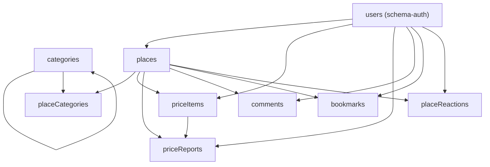

# Domain Schema Dependency Map

## Purpose
- 이 문서는 `src/db/schema.ts`에 남은 domain table을 추가 분리하기 전 dependency와 안전한 작업 순서를 고정한다.
- 목표는 DB 구조 변경이 아니라 schema module 경계 정리다.
- 이 문서의 범위는 table 정의 위치, import/re-export contract, circular dependency 위험에 한정한다.

## Current Split State
- 이미 분리된 module:
  - `src/db/schema-auth.ts`: `users`, `authAccounts`, `authSessions`, `authVerificationTokens`
  - `src/db/schema-operational.ts`: `visitActivities`, `publicWriteRateLimits`
  - `src/db/schema-moderation.ts`: `contentReports`, `adminActions`, `moderationSuggestions`
  - `src/db/schema-enums.ts`: Drizzle enum definitions
  - `src/db/schema-helpers.ts`: shared timestamp column helper
- `src/db/schema.ts`는 현재 legacy public contract module 역할을 유지한다.
  - 외부 코드는 계속 `@/db/schema`에서 import한다.
  - 새 split module을 만들더라도 `src/db/schema.ts`가 기존 export name을 re-export해야 한다.

## Remaining Domain Tables

| Table export | DB table | Depends on | Referenced by |
| --- | --- | --- | --- |
| `categories` | `categories` | self `parentId` | `placeCategories`, place submission/category lookup |
| `places` | `places` | `users.id` | `placeCategories`, `priceItems`, `priceReports`, `comments`, `bookmarks`, `placeReactions`, reports/admin/read repositories |
| `placeCategories` | `place_categories` | `places.id`, `categories.id` | seed, place submission/admin flows |
| `priceItems` | `price_items` | `places.id`, `users.id` | `priceReports`, admin price/read/write flows |
| `priceReports` | `price_reports` | `places.id`, `priceItems.id`, `users.id` | admin price review, public price reports, seed |
| `comments` | `comments` | `places.id`, `users.id` | comments write/read flows |
| `bookmarks` | `bookmarks` | `users.id`, `places.id` | bookmark routes/repository, seed |
| `placeReactions` | `place_reactions` | `users.id`, `places.id` | reaction routes/repository, map read/update flows |

## Dependency Shape

## Split Strategy

### Slice 1: Place Core
- Candidate module: `src/db/schema-place-core.ts`
- Move:
  - `categories`
  - `places`
  - `placeCategories`
- Why:
  - `places` is the central FK target for the remaining domain tables.
  - `placeCategories` depends on both `places` and `categories`, so keeping the three together avoids a circular import.
- Keep:
  - `src/db/schema.ts` imports/re-exports `categories`, `places`, `placeCategories`.
- Required checks:
  - `npm run typecheck`
  - `npm run lint`
  - `npm run db:generate`
  - `npm run hygiene:dead-code`
  - `git diff --check`
  - `npm run verify`
  - `npm run test:e2e:full -- tests/e2e/map.spec.ts`

### Slice 2: Price Domain
- Candidate module: `src/db/schema-pricing.ts`
- Move:
  - `priceItems`
  - `priceReports`
- Why:
  - `priceReports` depends on `priceItems`, `places`, and `users`.
  - Moving price tables together keeps approval/report flow schema local.
- Import from:
  - `schema-auth.ts`: `users`
  - `schema-place-core.ts`: `places`
- Required checks:
  - `npm run db:generate`
  - `npm run test:e2e:full -- tests/e2e/price-review.spec.ts`

### Slice 3: Social Place Interactions
- Candidate module: `src/db/schema-place-social.ts`
- Move:
  - `comments`
  - `bookmarks`
  - `placeReactions`
- Why:
  - These tables all depend on `places` and optional/required user identity.
  - Public comments, bookmarks, and reactions are operationally adjacent but separate from price approval.
- Import from:
  - `schema-auth.ts`: `users`
  - `schema-place-core.ts`: `places`
- Required checks:
  - `npm run db:generate`
  - `npm run test:e2e:full -- tests/e2e/comments.spec.ts`
  - `npm run test:e2e:full -- tests/e2e/bookmarks.spec.ts`

## Non-Negotiables
- Do not change table names, column names, enum names, indexes, primary keys, unique indexes, FK targets, or `onDelete` actions during module split slices.
- Do not update `drizzle/*.sql` unless a separate intentional schema migration is being performed.
- Do not make repositories import directly from new split modules in the same slice unless there is a specific reason.
  - The compatibility contract is `@/db/schema`.
- After every schema module split, `npm run db:generate` must report no schema changes.
- If `db:generate` creates a migration unexpectedly, stop and diagnose instead of committing the generated SQL.
